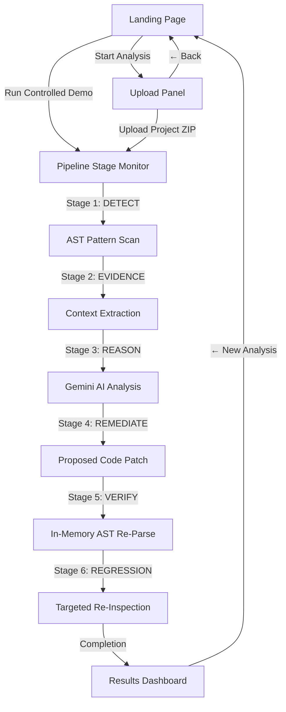

# SENTINEL-AI

**Autonomous Cyber Reasoning & Verified Defense**

> **Safety Boundary:** Static source-code analysis only — uploaded source code is NEVER executed at any point.
> **Scope Boundary:** Analyze only Python source code repositories you own or are explicitly authorized to audit.

---

## 1. Project Overview

**SENTINEL-AI** is an evidence-grounded cybersecurity analysis platform designed for authorized Python source-code projects. It combines **AST-based static vulnerability detection** with **Google Gemini AI context-aware cyber reasoning**, closed-loop code remediation, and **in-memory static verification**.

The application moves security beyond simple "detect-and-alert" tools by executing a six-stage autonomous pipeline:

`DETECT` → `COLLECT EVIDENCE` → `REASON` → `REMEDIATE` → `VERIFY` → `REGRESSION TEST`

SENTINEL-AI produces an evidence-grounded, non-hardcoded final verdict confirming whether proposed security remedies hold up under static re-inspection.

---

## 2. Problem Statement

Traditional Static Application Security Testing (SAST) tools and AI vulnerability scanners suffer from key flaws:

1. **Stop at Detection:** Standard SAST tools alert developers to potential flaws but leave manual root-cause investigation, patch writing, and re-testing entirely on developers.
2. **Unvalidated AI Suggestions:** Generic AI assistants often propose syntactically broken code, introduce new vulnerabilities, or hallucinate non-existent security issues.
3. **Execution Risks:** Some security test runners execute untrusted code to "test" it, introducing severe host compromise risks.
4. **Lack of Evidence:** Developers are frequently presented with vague alerts without exact line snippets, surrounding context, or verifiable proof.

---

## 3. What SENTINEL-AI Does

SENTINEL-AI solves these challenges by providing a closed-loop, evidence-backed security workflow:

* **Real AST-Based Detection:** Parses Python Abstract Syntax Trees (`ast` module) to pinpoint high-risk security patterns without executing code.
* **Evidence Collection:** Extracts exact file paths, line numbers, target code snippets, and surrounding context lines directly from source text.
* **Gemini AI Cyber Reasoning:** Uses the official Google GenAI SDK (`google-genai`) to generate context-aware root cause analysis, security impact assessment, and attack surface exposure evaluation.
* **Closed-Loop Remediation:** Generates category-specific, minimal code replacements tailored to the flagged pattern.
* **In-Memory Verification:** Statically re-parses and re-scans proposed code snippets to ensure syntax correctness and verify that the security rule no longer triggers.
* **Targeted Regression Checks:** Confirms the remediation does not re-introduce the original vulnerability detector.

---

## 4. Key Features

* **Interactive Landing Page:** Introduction and interactive presentation of system capabilities, boundaries, and workflow before entering analysis.
* **6-Stage Autonomous Pipeline:** Animated, real-time pipeline execution tracking each finding through all 6 stages.
* **Real Gemini AI Integration:** Structured JSON outputs (`AIReasoningResult`) via Google GenAI SDK with automatic candidate model fallbacks (`gemini-3.6-flash`, `gemini-3.5-flash-lite`, `gemini-2.5-flash`).
* **Deterministic Static Fallback:** Operates seamlessly in static fallback mode if `GEMINI_API_KEY` is omitted or unconfigured.
* **Safe ZIP Upload:** Secure handling with max upload limits (20MB), file count limits (2000 files), path traversal protection (`../`), and isolated temp directory extraction.
* **Controlled Demo Scenario:** Pre-bundled scenario allowing users to explore full platform capabilities instantly against sample vulnerable Python code (`report_tool.py`, `user_management.py`).
* **Multi-Column Results Dashboard:** Interactive security findings dashboard with side-by-side Before/After remediation code diffs and verification status badges.

---

## 5. System Architecture

```
sentinel-ai/
│
├── .env.example                  Environment variables template
├── .gitignore                    Git ignore rules for secrets, virtualenvs, & node_modules
├── README.md                     Project documentation
│
├── backend/                      FastAPI Application (Python 3.10+)
│   ├── main.py                   FastAPI entry point, CORS config, & API endpoints
│   ├── requirements.txt          Python dependencies (fastapi, uvicorn, pydantic, google-genai, python-dotenv)
│   ├── models/
│   │   └── schemas.py            Typed Pydantic models for all 6 pipeline stages
│   ├── core/
│   │   ├── project_loader.py     Safe ZIP archive validation & path traversal protection
│   │   ├── scanner.py            Stage 1 — AST static vulnerability detectors
│   │   ├── evidence.py           Stage 2 — Line snippet & context line collector
│   │   ├── gemini_reasoning.py   Stage 3 — Google Gemini AI cyber reasoning integration
│   │   ├── reasoning.py          Stage 3 — Reasoning builder with static fallback
│   │   ├── remediation.py        Stage 4 — Proposed code patch generator
│   │   ├── verifier.py           Stage 5 — In-memory AST re-parser & rule verifier
│   │   ├── regression.py         Stage 6 — Targeted static regression checker
│   │   └── pipeline.py           Pipeline orchestrator & concurrent ThreadPoolExecutor engine
│   └── samples/
│       └── vulnerable_demo/      Sample Python files for controlled demo scenario
│
└── frontend/                     React 18 + TypeScript + Vite + Tailwind CSS
    ├── index.html                HTML entry point with Inter & JetBrains Mono fonts
    ├── package.json              Node dependencies & scripts
    ├── tailwind.config.js        Custom dark mode theme tokens (bg-void, panel, accent, safe, warn, danger)
    ├── vite.config.ts            Vite configuration with /api backend proxy
    └── src/
        ├── App.tsx               Navigation state machine ("landing" | "upload" | "running" | "results")
        ├── main.tsx              React DOM mount
        ├── index.css             Tailwind directives & custom scrollbars/animations
        ├── api/client.ts         Fetch client wrapper for backend API endpoints
        ├── types/index.ts        TypeScript interface definitions matching backend Pydantic schemas
        └── components/
            ├── LandingPage.tsx       8-section presentation landing page
            ├── UploadPanel.tsx       Drag-and-drop ZIP archive upload panel
            ├── Pipeline.tsx          Animated 6-stage execution progress monitor
            ├── ResultsDashboard.tsx  Multi-column findings & verdict dashboard
            ├── FindingCard.tsx       Sidebar card component for individual findings
            ├── EvidencePanel.tsx     Stage 2 panel showing code snippet & AST details
            ├── ReasoningPanel.tsx    Stage 3 panel detailing root cause & security principles
            ├── RemediationPanel.tsx  Stage 4 panel with side-by-side Before/After code patches
            ├── VerificationPanel.tsx Stage 5 & 6 static verification checks
            └── FinalResult.tsx       Top verdict banner (VERIFIED DEFENSE / PARTIALLY VERIFIED)
```

---

## 6. Complete User Workflow



---

## 7. The Six-Stage Pipeline

1. **DETECT:** AST-based static detectors parse source code into Abstract Syntax Trees using Python's native `ast` module to detect dangerous patterns.
2. **COLLECT EVIDENCE:** Extracts target line numbers, code snippets, surrounding context lines (2 lines before/after), AST node classification, and rule attribution.
3. **REASON:** Calls Google Gemini AI (`gemini-3.6-flash`, `gemini-3.5-flash-lite`) via structured JSON schema to generate context-aware root cause, security impact, attack surface analysis, and remediation strategy.
4. **REMEDIATE:** Generates minimal, category-specific proposed replacement code in-memory. Original files on disk are never modified.
5. **VERIFY:** Statically re-parses the proposed code snippet using Python's `ast.parse` and re-runs the detection rule to verify the vulnerability pattern is completely eliminated.
6. **REGRESSION TEST:** Re-executes targeted static security checks to confirm the fix does not re-trigger the original detector.

---

## 8. Technology Stack

* **Frontend:** React 18, TypeScript, Vite, Tailwind CSS
* **Backend:** FastAPI (Python 3.10+), Uvicorn, Pydantic v2, `python-dotenv`
* **AI Engine:** Google GenAI Python SDK (`google-genai`), Structured JSON Schema Outputs
* **Concurrency:** `concurrent.futures.ThreadPoolExecutor` for parallel AI reasoning
* **Static Parser:** Python native `ast` module

---

## 9. Gemini AI Integration

SENTINEL-AI leverages the official **Google GenAI SDK** for deep cyber reasoning:

* **Structured Outputs:** Enforces typed Pydantic schema validation (`AIReasoningResult`) for API responses.
* **Automatic Model Fallback:** Tries candidate models in order (`gemini-3.6-flash` → `gemini-3.5-flash-lite` → `gemini-2.5-flash`) to ensure high availability during rate limits or temporary demand spikes.
* **Graceful Static Fallback:** If `GEMINI_API_KEY` is omitted or unconfigured, SENTINEL-AI automatically operates in deterministic static fallback mode.

---

## 10. Supported Analysis Scope (MVP)

| Category | Rule ID | Detection Basis |
| :--- | :--- | :--- |
| **Unsafe Command Execution** | `SENTINEL-CMD-001` | `os.system`, `os.popen`, `subprocess.Popen`/`run` with `shell=True` |
| **Unsafe Deserialization** | `SENTINEL-DESER-001` | `pickle.load`/`loads`, `yaml.load` without `SafeLoader` |
| **Hardcoded Secrets** | `SENTINEL-SECRET-001` | Variable assignments matching credential keywords (`password`, `secret`, `token`, `key`) with string literals |
| **SQL Injection Risk** | `SENTINEL-SQL-001` | `.execute()`/`.executemany()` query strings constructed via f-strings, concatenation, `%`-formatting, or `.format()` |
| **Weak Cryptography** | `SENTINEL-CRYPTO-001` | `hashlib.md5` / `hashlib.sha1` usage |

---

## 11. Security & Safety Boundaries

SENTINEL-AI strictly enforces security boundaries:

* **Zero Code Execution:** Uploaded code is NEVER executed, compiled, or run on the host system.
* **Minimal AI Context:** Only minimal finding code snippets are sent to Gemini AI—never entire repository files.
* **Backend Key Isolation:** `GEMINI_API_KEY` is loaded exclusively on the backend server and is never exposed to the frontend browser client.
* **Isolated Extraction:** Uploaded ZIP archives are extracted into isolated temporary directories with strict size limits and path traversal protection (`../`).
* **No Auto-Deployment:** Proposed code fixes are displayed as in-memory diffs; SENTINEL-AI does not write to or deploy changes to user projects.

---

## 12. Installation Instructions

### Prerequisites
* **Python 3.10+**
* **Node.js 18+** & `npm`

### Clone Repository
```bash
git clone <your-repository-url>
cd sentinel-ai
```

---

## 13. Backend Setup Instructions

1. Navigate to backend directory:
   ```bash
   cd backend
   ```
2. Create and activate a Python virtual environment:
   ```bash
   python -m venv .venv
   # On Windows PowerShell:
   .venv\Scripts\Activate.ps1
   # On Linux/macOS:
   source .venv/bin/activate
   ```
3. Install dependencies:
   ```bash
   pip install -r requirements.txt
   ```

---

## 14. Frontend Setup Instructions

1. Navigate to frontend directory:
   ```bash
   cd frontend
   ```
2. Install Node dependencies:
   ```bash
   npm install
   ```

---

## 15. Environment Variable Setup

Copy `.env.example` to create `.env` in the `backend/` directory:

```bash
cp .env.example backend/.env
```

Edit `backend/.env` to configure your Google Gemini API key:

```env
GEMINI_API_KEY=your_actual_gemini_api_key_here
```

*(If `GEMINI_API_KEY` is omitted, SENTINEL-AI automatically runs in static fallback mode).*

---

## 16. How to Run Locally

### Start Backend Server (Terminal 1)
```bash
cd backend
.venv\Scripts\activate
python -m uvicorn main:app --host 127.0.0.1 --port 8000
```
Backend API health endpoint: `http://localhost:8000/api/health`  
Interactive Swagger API documentation: `http://localhost:8000/docs`

### Start Frontend Dev Server (Terminal 2)
```bash
cd frontend
npm run dev
```
Open web browser at `http://localhost:5173`.

---

## 17. How to Use the Controlled Demo

1. Open `http://localhost:5173` in your browser.
2. Click **RUN CONTROLLED DEMO**.
3. Watch the six-stage pipeline execute against the bundled sample project (`backend/samples/vulnerable_demo/`).
4. Inspect findings, Gemini AI reasoning, and verified remediation diffs on the Results Dashboard.

---

## 18. How to Upload Authorized Python Projects

1. Compress your authorized Python project files into a `.zip` archive.
2. Open `http://localhost:5173` and click **START ANALYSIS** (or **ANALYZE AUTHORIZED CODE**).
3. Drag and drop your `.zip` file into the upload zone.
4. Click **Run SENTINEL Analysis**.
5. View evidence-backed findings and verified proposed defenses on the dashboard.

---

## 19. Current Limitations

* **Language Support:** Current MVP supports Python source code (`.py` files).
* **Detector Scope:** Focused on 5 core vulnerability categories; does not perform full SAST coverage (no SSRF, XXE, or dependency CVE scanning).
* **Static Inspection:** Operates on Abstract Syntax Tree shapes rather than full inter-procedural taint analysis.
* **Proposed Fixes:** Remediations are generated as in-memory proposed diffs for developer review and are not automatically deployed into user source repositories.

---

## License & Disclaimer

SENTINEL-AI is a hackathon cybersecurity prototype designed strictly for static source-code analysis of authorized repositories. Uploaded source code is never executed.
